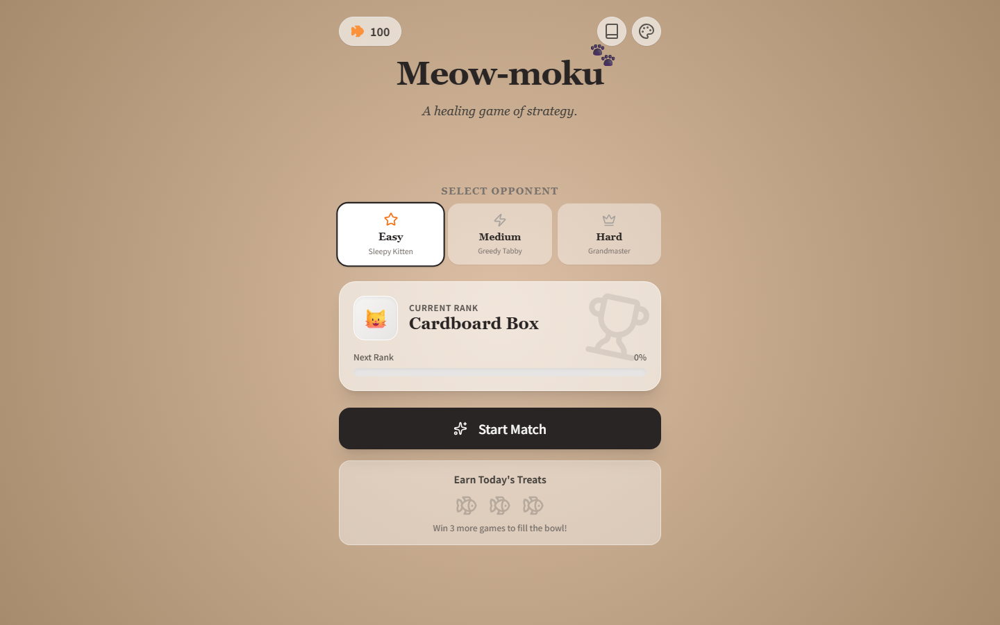

# Meow-moku 小猫五子棋

A healing cat-themed Gomoku (five-in-a-row) game: play against a local-algorithm AI opponent, collect cat skins, climb ranks, earn treats.

治愈系猫咪五子棋：本地算法 AI 对手、猫咪皮肤收集、排位等级与小鱼干经济、难度选择、对局记录。

**▶ Live: https://sunnywang666.github.io/cats/**



## Highlights

- AI opponent is a pure local algorithm — no API key, no network needed, three difficulty tiers (Sleepy Kitten / Greedy Tabby / Grandmaster) / AI 对手为纯本地算法，无需联网与 key，三档难度
- Retention loop designed up front: rank ladder, daily treats, skin collection driven by a written game design document / 先写 GDD 再开发，排位、每日奖励、皮肤收集构成留存循环
- Dynamic cat pieces change posture by board context (lonely / snuggling / crowded) / 棋子猫咪按局面切换姿态

## Tech Stack

React 19 · TypeScript · Vite

## Run Locally

```bash
npm install
npm run dev
```

No API key required. The `GEMINI_API_KEY` reference in `vite.config.ts` is an AI Studio template leftover — nothing in the code calls it (an early prototype used Gemini for the AI opponent; it was replaced by the local algorithm).

无需配置任何 API key。`vite.config.ts` 里的 `GEMINI_API_KEY` 是 AI Studio 模板残留，代码中没有任何调用（早期原型曾用 Gemini 做对手，后已替换为本地算法）。
